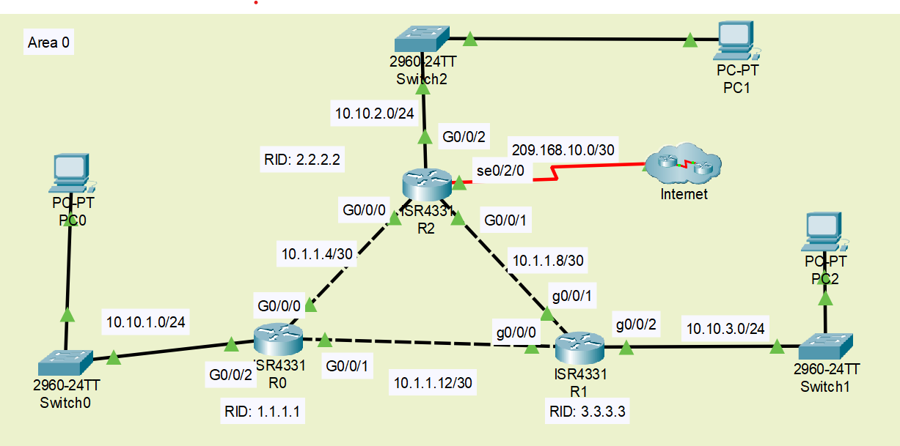

# Backup static routes and dynamic routing



## Commands to apply OSPF

### R0

```
Router>enable
Router#conf t
Router(config)#router ospf 10
Router(config-router)#router-id 1.1.1.1
Router(config-router)#passive-interface g0/0/2
Router(config-router)#exit
Router(config)#int g0/0/0
Router(config-if)#ip ospf 10 area 0
Router(config-if)#int g0/0/1
Router(config-if)#ip ospf 10 area 0
Router(config-if)#int g0/0/2
Router(config-if)#ip ospf 10 area 0
Router(config-if)#do copy run start
Router(config-if)#exit
```

### R1

```
Router>enable
Router#conf t
Router(config)#router ospf 10
Router(config-router)#router-id 3.3.3.3
Router(config-router)#passive-interface g0/0/2
Router(config-router)#int g0/0/0
Router(config-if)#ip ospf 10 area 0
Router(config-if)#int g0/0/1
Router(config-if)#ip ospf 10 area 0
Router(config-if)#int g0/0/2
Router(config-if)#ip ospf 10 area 0
Router(config-if)#do copy run start
```

### R2

```
Router>enable
Router#conf t
Router(config)#router ospf 10
Router(config-router)#router-id 3.3.3.3
Router(config-router)#passive-interface g0/0/2
Router(config-router)#int g0/0/0
Router(config-if)#ip ospf 10 area 0
Router(config-if)#int g0/0/1
Router(config-if)#ip ospf 10 area 0
Router(config-if)#int g0/0/2
Router(config-if)#ip ospf 10 area 0
Router(config-if)#do copy run start
```

## Commands to apply Addressing

### R0

```
Router#conf t
Router(config)#int g0/0/0
Router(config-if)#description LINK to LAN 10.1.1.4/30
Router(config-if)#ip add 10.1.1.5 255.255.255.252
Router(config-if)#no sh
Router(config-if)#int g0/0/2
Router(config-if)#description LINK to LAN 10.10.1.0/24
Router(config-if)#ip add 10.10.1.1 255.255.255.0
Router(config-if)#no sh
Router(config-if)#int g0/0/1
Router(config-if)#description LINK TO LAN 10.1.1.12/30
Router(config-if)#ip add 10.1.1.13 255.255.255.252
Router(config-if)#no sh
Router(config-if)#do copy run start
```

### R1

```
Router#conf t
Router(config)#int g0/0/0
Router(config-if)#description LINK to LAN 10.1.1.4/30
Router(config-if)#ip add 10.1.1.5 255.255.255.252
Router(config-if)#no sh
Router(config-if)#int g0/0/2
Router(config-if)#description LINK to LAN 10.10.1.0/24
Router(config-if)#ip add 10.10.1.1 255.255.255.0
Router(config-if)#no sh
Router(config-if)#int g0/0/1
Router(config-if)#description LINK TO LAN 10.1.1.12/30
Router(config-if)#ip add 10.1.1.13 255.255.255.252
Router(config-if)#no sh
Router(config-if)#do copy run start
```

### R2

```
Router>enable
Router#conf t
Router(config)#int g0/0/0
Router(config-if)#description LINK TO LAN 10.1.1.4/30
Router(config-if)#ip add 10.1.1.6 255.255.255.252
Router(config-if)#no sh
Router(config-if)#int g0/0/1
Router(config-if)#description LINK TO LAN 10.1.1.8/30
Router(config-if)#ip add 10.1.1.10 255.255.255.252
Router(config-if)#no sh
Router(config-if)#int g0/0/2
Router(config-if)#description LINK TO LAN 10.10.2.0/24
Router(config-if)#ip add 10.10.2.1 255.255.255.0
Router(config-if)#no sh
Router(config-if)#do copy run start
Router(config-if)#int s0/2/0
Router(config-if)#description LINK TO WAN 209.168.10.0/30
Router(config-if)#ip add 209.168.10.1 255.255.255.252
Router(config-if)#no sh
```

### INTERNET

```
Router>enable
Router#conf t
Router(config)#int s0/1/0
Router(config-if)#description LINK TO WAN 209.168.10.0/30
Router(config-if)#ip add 209.168.10.2 255.255.255.252
Router(config-if)#no sh
Router(config)#ip route 0.0.0.0 0.0.0.0 s0/1/0
Router(config)#do copy run start
```

## Commands to apply DHCP

### R0

```
Router>enable
Router#conf t
Router(config)#ip dhcp excluded-address 10.10.1.1
Router(config)#ip dhcp pool POOL_LAN0
Router(dhcp-config)#network 10.10.1.0 255.255.255.0
Router(dhcp-config)#default-router 10.10.1.1
Router(dhcp-config)#dns-server 8.8.8.8
Router(dhcp-config)#domain-name cctbcollege.ca
Router(dhcp-config)#do copy run start
```

### R1

```
Router>enable
Router#conf t
Router(config)#ip dhcp excluded-address 10.10.3.1
Router(config)#ip dhcp pool POOL_LAN1
Router(dhcp-config)#network 10.10.3.0 255.255.255.0
Router(dhcp-config)#default-router 10.10.3.1
Router(dhcp-config)#dns-server 8.8.8.8
Router(dhcp-config)#domain-name cctbcollege.ca
Router(dhcp-config)#do copy run start
```

### R2

```
Router>enable
Router#conf t
Router(config)#ip dhcp excluded-address 10.10.2.1
Router(config)#ip dhcp pool POOL_LAN2
Router(dhcp-config)#network 10.10.2.0 255.255.255.0
Router(dhcp-config)#default-router 10.10.2.1
Router(dhcp-config)#dns-server 8.8.8.8
Router(dhcp-config)#domain-name cctbcollege.ca
Router(dhcp-config)#do copy run start
```

## Commands to apply security

console 0 - cisco1
vty - cisco2
enable - class

### R0 - R1 - R2

```
Router>enable
Router#conf t
Router#hostname R(number)
Router(config)#security passwords min-length 8
Router(config)#line console 0
Router(config-line)#password cisco1
Router(config-line)#login
Router(config-line)#exec-timeout 3 30
Router(config-line)#exit
Router(config)#line vty 0 15
Router(config-line)#password cisco2
Router(config-line)#login
Router(config-line)#transport input ssh
Router(config-line)#exec-timeout 3 30
Router(config-line)#exit
Router(config)#enable secret class
Router(config)#service password-encryption
Router(config)#login block-for 120 attempts 3 within 20
Router(config)#banner motd #R1 - CCTB - Networks#
Router(config)#do copy run start
```
